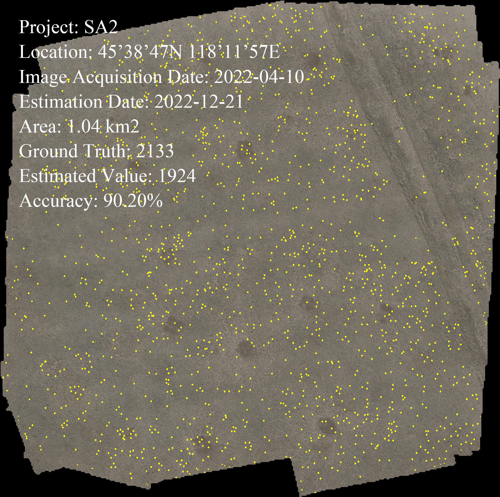

# Brandt's vole hole detection and counting method based on deep learning and unmanned aircraft system
## Prerequisite

Python 3.7

Pytorch 1.7.0

## Code structure

`inference_one_image.py` To predict one big image. 

`inference_patch.py` To predict sub-images. 

`inference_patch_segmentation.py` To segment one big image into sub-images. 

## Structure

The structure of the network. 

## Result

FCOS: mAP 95.19% precision 84.70 recall 93.28 f1-score 0.89 FPS 50.12

Accuracy: 90.20%

## Data & best_epoch_weights

The code and data used are available at Zenodo https://doi.org/10.5281/zenodo.8278962.
