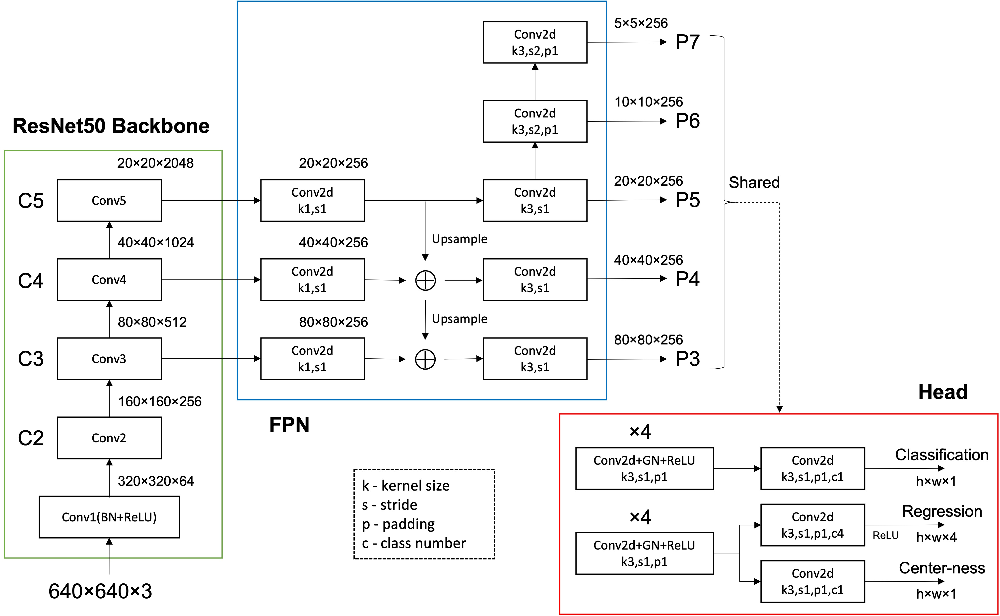
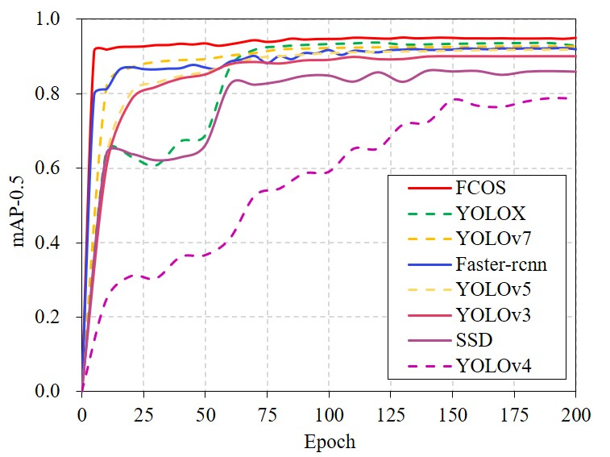

# Brandt's vole hole detection and counting method based on deep learning and unmanned aircraft system
## Prerequisite

Python 3.7

Pytorch 1.7.0

## Code structure

`inference_one_image.py` To predict one big image. 

`inference_patch.py` To predict sub-images. 

`inference_patch_segmentation.py` To segment one big image into sub-images. 

## Structure

The structure of the network. 

## Result

GWD + UEC: epoch187 MAE 6.38 MSE 11.80

